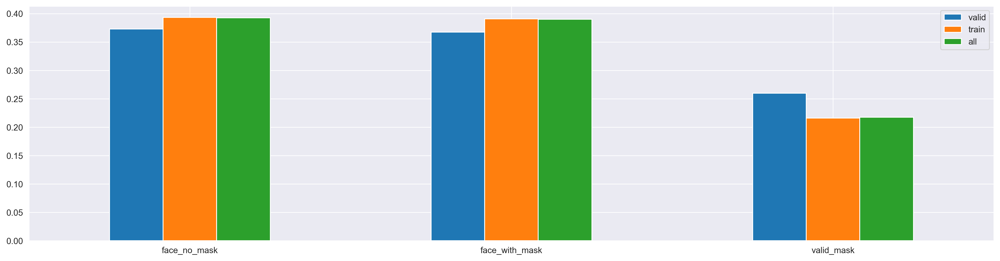

# Autonomous Drone Demo - Mask and Phone Detection
 

This gif is pretty large and may lack until fully loaded, be patient :)

  

The program that controls the drone is essentially capable of 3 things:
 
1. Orient the drone towards people it detects (indicated by the red arrow) 

2. Determine if the people it detects are wearing appropriate facial masks (colored boxes)

3. Detect faces and cell phones which could be used to check COVID-19 vaccines. (small cutouts in the right panel)

  

  **Note**:  
  I don't suggest that this is ethically or practically feasible to implement in reality. This was simply a learning experience and a fun project, nothing more.

# Acknowledgement

Object detection and classification was done with Ultralytic's Pytorch implementation of YOLO5:
 
https://github.com/ultralytics/yolov5.
 
 
Training a YOLO5 model capable of detecting faces with and without masks was made possible with Humansintheloop's mask dataset:
 
https://humansintheloop.org/resources/datasets/mask-dataset-download
 
 
Tello's drone and python API has obviously been essential to the project: 
https://djitellopy.readthedocs.io/en/latest/tello/
 
 
Automatically assigning bounding boxes to faces which was missing one was done with the help of the timesler's face detection model:
 
https://github.com/timesler/facenet-pytorch

# Motivation
I've learned a lot about machine learning from projects that I've completed during my time at university. With that said, I often felt that these projects were somewhat artificial in nature, because many of the challenges had been solved for us students beforehand. Especially 2 areas felt neglected:

    1.) Datasets from scratch / data preprocessing
    2.) Getting models ready for production

I felt like the best way to get some experience within these 2 areas was to make a non-trivial project were these 2 areas were the main focus.  Area 1.) I've previously finished a project were I made the dataset from scratch [see here](https://github.com/Jako-K/set_finder_project) and therefor through I would focus on the data preprocessing. I tried to do this by using [Humansintheloop mask dataset](https://humansintheloop.org/resources/datasets/mask-dataset-download), clean it and than combine it with a subset of the [COCO dataset](https://cocodataset.org/#home).
 
Area 2.) Since I have never really worked with anything that had to interact directly with the real world (i.e. a robot of sorts) I thought doing something along those lines would be a good learning experience. And so ended up making a project around the relatively inexpensive [Tello Drone](https://www.ryzerobotics.com/tello)

# Project overview
The main goal of the project is to make the Tello drone capable of detecting and position itself towards people with and without masks. The secondary goal is to detect cell phones, which could be used to show q-codes with vaccine details or something similar.  
An overview of the project is shown below followed by an in depth explanations of each of the 4 subproblems 1.) 2.), 3.) and 4.).

  

## 1.) Cleaning the mask dataset
Humansintheloop's mask dataset (HMD) contains 20 classes and roughly 6000 annotated images (bounding boxes). Example shown below 
 

    

 

### Code
Code for this section can be found in `./preprocessing/clean_mask_dataset.ipynb` and `./utils/helpers.py`.
 
 

### Removing classes and a first look at the class distribution
The majority of HMD's 20 classes is irrelevant to the project e.g. whether a person is wearing sun glasses, a hoodie or a niqab. After removing the annotations from these classes, the dataset had the class distribution shown below. The relatively large class imbalance pretty much has to be dealt with in order for us to train a decent model.
  

    

 

I see no reason to keep the `face_other_covering` category since it does little to prevent the spread of viruses (and include stuff like glasses) which is why I'm going to merge it with `face_no_mask`. Examples:
 
 

    

    

 

### Closer look at: mask_colorful, face_sheild and mask_surgical
`mask_colorful` and `face_sheild` seems as valid to wear as `mask_surgical`, which is why I would like to merge all 3 into a combined class which could be called `valid_mask`. 

The problem is that the `face_shield` class is kinda difficult to deal with. As you can see below, a face without an actual mask is labeled as `face_no_mask` which kinda defeat the purpuse of the class `valid_mask` being synonymous with `ALL_GOOD`. Secondly the vast majority of the faces wearing a `face_shield` also wears a mask which is going to be a problem for the model to deal with. All in all, the relatively small amount of labeled `face_shield` samples combined with the troubles associated with it, made be think it would be best to simply remove the label entirely. This decision is admittedly not optimal, but neither is it to do nothing. Examples:
  

    

    

 

### Closer look at face_with_mask_incorrect
It would be nice to check if the mask is applied correctly, but its not super important for the use case I intend i.e. check if a person is wearing a mask. This along with the low number of samples for this category, make me think it would be reasonable to merge `face_with_mask_incorrect` with `face_with_mask`.
 
 

### Final class distribution after train-validation split
`face_no_mask` is still off by ~50%, but I think it's going to be okay. Might have to use label smoothing or some other technique to deal with the reamaining imbalance, but that's not something I'm gonna worry about at this stage.
 

    

 

## 2.) Merging COCO's cell_phone class with MHD
The idea is to combine the modified MHD dataset with COCO's cell_phone class which would yield a dataset comprised of the following classes:

      [face_no_mask, face_with_mask, valid_mask, cell_phone]
Which sounded pretty simple at first, but ended up being pretty challenging. 
 
 

### Code
Code for this section can be found in `./preprocessing/coco_download_cell_phone_data.ipynb`, `./preprocessing/coco_annotate_faces.ipynb` and `./utils/helpers.py`.
 
 
### Annotations for non-face wearing people
the COCO dataset has annotations for cell phones, but not for human faces. This is problematic when combining COCO and MHD. The problem is that the model cannot handle people without masks being labeled as `face_without_mask` in MHD images, but not in the COCO images.
  
I tried to ignore this and train the model on the combined dataset anyway, just to see what would happened. The result of this, was a model that learned to detect `valid_mask`, `faces_with_mask` and `cell_phone` quite well, but did absolutely terrible on `faces_without_mask`. The reason for this, is in all likelihood that the model is confused about all the faces without masks there's present in `cell_phone` images which is not annotated as `faces_without_mask`. After thinking about a solution to this, which didn't include starting starting all over, I figured why not just automatically annotate all the faces present in all the `cell_phone` images? The odds that more than a few faces was wearing masks were very slim (dataset made much before covid19) and all faces could therefor just be labeled as `faces_without_mask`. 
  This worked pretty well, but the model definitely made annotation mistakes. Furthermore, the MHD annotates the entire face including hair, whereas the [model use for automatic face annotation](https://github.com/timesler/facenet-pytorch) didn't, which is obviously not ideal.
  
Example (red = automatically annotated `faces_without_mask`, green = real annotated `cell_phone`)

    

  

### Results:

    

 
I ended up using two models instead of a single combined one (one for cell phone detection and one for the rest), because it yielded better results than the one model setup - the one model setup did pretty well though. I chose to include section 2.) anyway, because I learned a lot from it and because my approach felt worthwhile sharing.
  

## 3.) YOLO5
Ultralytic (the creators of the YOLO implementation used in the project) has made it relatively straight forward to train their YOLO-model on a custom dataset, as long as their format requirements are met (.yaml setup file, specific folder structure etc.). 

 

More specifically, Ultralytic has made a `train.py` which work sort of like a command line API. I changed some hyperparameters, but other than that simply used their `train.py` to finetune their largest pretrained YOLO-model: `yolov5l`. I trained a fair few models with different hyperparameters, but the results were almost identical, which made be conclude that there in all likelihood weren't a lot to gain from hyperparameter tuning. Weights for the final model can be found at `./main/yolo_mask_model.pt`
  

### Training with Weights and Biases
[Weights and Biases](https://wandb.ai) was an integrated part of the training phase which made it super easy to monitor the model's performance. I've included some of the key figures here
  
<u>Train loss:</u>

 
<u>Validation loss:</u>

 
<u>Validation metrics:</u>

  

### Predictions by the final model
The final model performs very well and is quite robust. I have only seen few classification mistakes while playing around with it, and the bounding box placement seems very reasonable as well. Funny enough, the most troubles I have had with the final model, has been with the pretrained YOLO5 model. The only real thing this model needs to do is to detect cell phones, but it's struggling at times. I don't know if it's because the COCO dataset is quite old and many of the annotated phones in it is far from a modern smart phone. Or if it's a implementation mistake on my part, but it is differently not as robust as I had expected. With that said, it still performs quite well and definitely do better than the one I trained on the COCO-MHD combined dataset.
  
Example:

    

https://www.freepik.com/free-photo/woman-outdoors-wearing-mask-using-mobile-phone_7324995.htm
  

## 4.) Drone logic and visualizations
This entire section can be summed up quite nicely with a single image:

    

https://www.freepik.com/free-photo/medium-shot-man-holding-bag-phone_11380300.htm
 
 

1. The unprocessed image gets captured by the drone's camera.
2. The captured image than gets send through the 2 YOLO5 models and annotated accordingly
3. Any face and/or cell phones present in the image get displayed alongside some general information about the drone (e.g. battery and height) and its current state (e.g. if its searching and which command it received last).
4. Isn't shown here, but that would be the movement of the drone itself according to the data obtained in the previous 3 steps
 

### Code
Code for this section can be found in `./main/main_logic.py`, `./main/yolo5_model.py`, `./utils/yolo5_model.py` and `./utils/helpers.py`.
